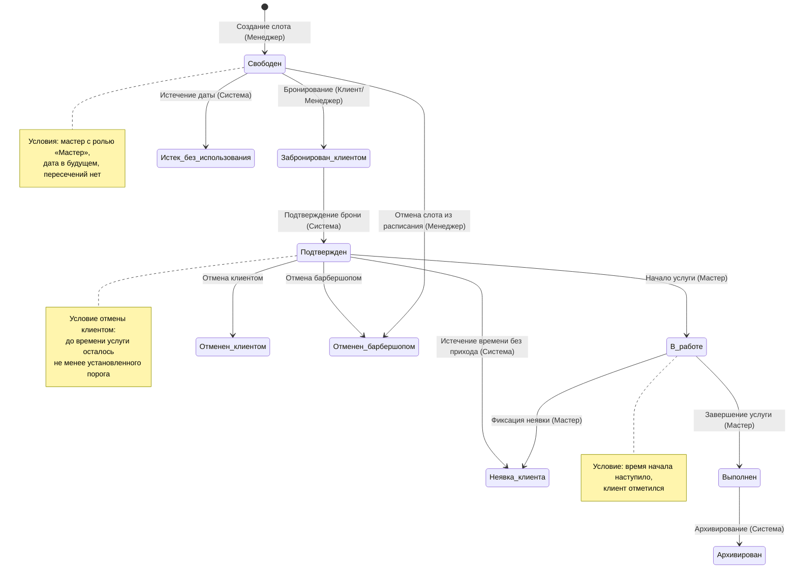

# Диаграмма состояний объекта «Слот обслуживания»

## Ex.01 — Жизненный цикл объекта «Слоты обслуживания»

## Легенда

| Инициатор | Действие |
|-----------|----------|
| Менеджер | Создание слота, отмена слота/брони |
| Клиент | Бронирование, отмена брони |
| Мастер | Начало/завершение услуги, фиксация неявки |
| Система | Подтверждение брони, автосмена статусов, архивирование |
